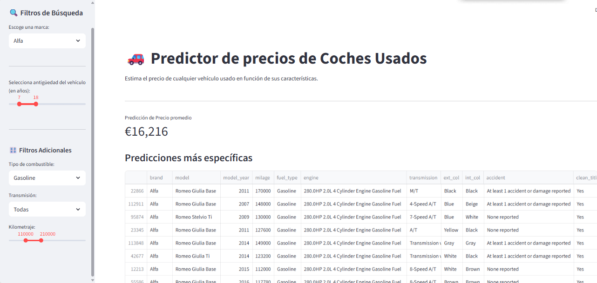

# Predictor de Precios de Vehículos Usados

**Proyecto de _regresión_ para predecir los precios de coches de segunda mano, desarrollado utilizando un modelo de _Machine Learning_ entrenado con datos reales.**

---

## 🧭 Índice


- [📌 Resumen del Proyecto](#-resumen-del-proyecto)  
- [📎 Enlaces Útiles](#-enlaces-útiles)  
- [🎯 Público Objetivo](#-público-objetivo)  
- [🧠 Arquitectura y Servicios](#-arquitectura-y-servicios)  
- [🚀 Futuras Implementaciones](#-futuras-implementaciones)  
- [🛠️ Herramientas y Tecnologías](#-herramientas-y-tecnologías)  
- [📁 Estructura del Proyecto](#-estructura-del-proyecto)  
- [✍️ Instrucciones de Uso](#-instrucciones-de-uso)  
- [👩‍💻 Contribuidores](#-contribuidores)   

---

## 📌 Resumen del Proyecto 

<p align="justify">  
Este proyecto es una aplicación web que utiliza un modelo de <strong>regresión</strong> para estimar el precio de venta de coches de segunda mano. El modelo ha sido entrenado con un amplio conjunto de datos que incluye variables clave como la marca, el modelo, el año, el kilometraje, el tipo de motor y la condición del vehículo, entre otros. El objetivo es ofrecer una herramienta fiable tanto para vendedores que quieren fijar un precio justo como para compradores que desean verificar si una oferta es razonable.
</p>  



---

### ✨ Características  

| ✅ Puntos Fuertes | ❌ Limitaciones |
|----------------------------------------------------------|-----------------------------------------------------------------------|
| Modelo de Machine Learning entrenado y optimizado.       | La precisión del modelo puede verse afectada por la entrada de datos atípica. |
| Interfaz de usuario intuitiva para una fácil predicción. | No considera factores externos como la ubicación geográfica o la demanda del mercado local. |
| Rápida estimación de precios en tiempo real.             | El modelo no se actualiza automáticamente con nuevos datos del mercado. |
| Permite el análisis de diferentes variables del vehículo.| La base de datos de modelos de coches es limitada y podría expandirse. |

---

## 📎 Enlaces Útiles

- [Repositorio en GitHub](https://github.com/Factoria-F5-madrid/ai-project-Regression_equipo4) 
---

## 🎯 Público Objetivo  

- **Vendedores particulares** que necesitan ayuda para fijar un precio competitivo a su vehículo.  
- **Compradores** que desean verificar si el precio de un coche usado es justo.  
- **Concesionarios o profesionales del sector** que buscan una herramienta rápida de tasación inicial.  
- **Analistas de datos** interesados en la aplicación práctica de modelos de regresión.  

---

## 🧠 Arquitectura y Servicios 

<p align="center">
  <alt="Diagrama de Arquitectura" width="700px"/>
</p>

- **Frontend:** Streamlit  
- **Modelo de ML:** Entrenado con bibliotecas como Scikit-learn, TensorFlow o PyTorch.  
- **Datos:** Conjunto de datos de vehículos usados en Kaggle.

---

## 🚀 Futuras Implementaciones 

- **Ampliar el dataset** para incluir más marcas, modelos, años y tipo de coches como por ejemplo, coches de lujo o ultra lujo.  
- Integrar la **geolocalización** para considerar las diferencias de precios por región.  
- Desarrollar una **FastAPI** para conectar la web con las bases de datos. 
- Implementar un sistema de **actualización automática del modelo** (por ejemplo, reentrenarlo periódicamente con nuevos datos).  
- Añadir un **análisis de tendencias** del mercado.  

---

## 🛠️ Herramientas y Tecnologías  

### ⚙️ Backend y Modelo  


### 🌐 Frontend  


---

## 📁 Estructura del Proyecto

📦 ai-project-Regression_equipo4
├── 📁 datasets
│   ├── predicted_prices_for_frontend.csv
│   ├── train_cleaned.csv
│   └── train.csv
├── 📁 frontend
│   └── 🗒️ app.py
├── 📁 images
│   ├── Banner.png
│   └── screenshot.png
├── 📁 notebooks
│   ├── lasso.ipynb
│   ├── random_forest.ipynb
│   ├── regression_tree.ipynb
│   └── ridge.ipynb
├── 🗒️ README.md
├── 🗒️ requirements.txt
*** End Patch

---

## ✍️ Instrucciones de Uso

🧪 1. Clonar Repositorio 

git clone [https://github.com/Factoria-F5-madrid/ai-project-Regression_equipo4.git](https://github.com/Factoria-F5-madrid/ai-project-Regression_equipo4.git)

📦 2. Instalar Requisitos

# Se requiere la versión de Python 3.8 o superior

```
pip install -r requirements.txt
```

🚀 3. Ejecución

```
cd frontend
streamlit run app.py
```

---
## 👩‍💻 Contribuyentes

| Nombre                  | GitHub                                                                                                                     | LinkedIn                                                                                                                                             |
|-----------------------|----------------------------------------------------------------------------------------------------------------------------|------------------------------------------------------------------------------------------------------------------------------------------------------|
| **Ciprian Nica** | [](https://github.com/CiprianNica)         | [](https://www.linkedin.com/in/ciprian-nica/)                   |
| **Ignacio Castillo Franco** | [](https://github.com/IgnacioCastilloFranco)         | [](https://www.linkedin.com/in/ignacio-castillo-franco/)                   |
| **Teo Ramos Ruano** | [](https://github.com/Argendion)         | [](https://www.linkedin.com/in/teo-ramos-ruano/)                   |
| **Aroa Mateo Gómez** | [](https://github.com/Arowi95)         | [](https://www.linkedin.com/in/aroamateogomez/)                   |
